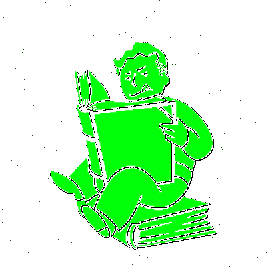
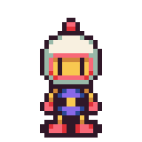
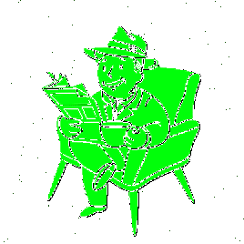
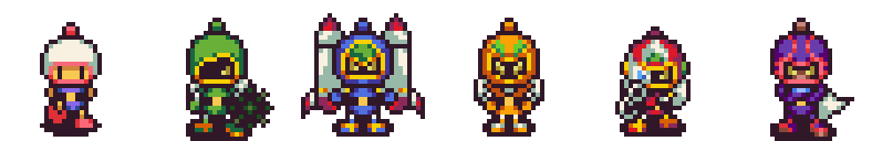

<!--**Tawan-B/Tawan-B** is a ✨ _special_ ✨ repository because its `README.md` (this file) appears on your GitHub profile.-->

    
<!-- Title (Dark) -->

<!-- Title (Light) -->

  

    👨‍💻 I'm returning to my code and data journey after a short break, i enjoy learning new languages, libraries, and frameworks. I'm currently learning: 
  

   
  

    
    
    
               
    
    
    
    
    
    
    
    
    
    
    
      
  

  

    💻 Interesting technologies which I hope to learn in the future: 
  

   
  

    
    
    
    
    
      
  

  

    💬 Inspirational quotes that keep me motivated to code and express my perspective: 
  

   
  <ul>
    <li id="quote???">
      <i>
        “The key to success in life is having that lifelong passion for learning that extends beyond good grades, test scores, and graduation dates”
      </i>
      🎓
    </li>
     
    <li id="quoteAristotle">
      <i>
        “The ignorant man affirms, the scientist doubts, the wise man reflects.” ~ Aristotle
      </i>
      📚
    </li>
      
    <li id="quoteSagan">
      <i>
        “We live in a society exquisitely dependent on science and technology, in which hardly anyone knows anything about science and technology. This is a clear prescription for disaster.” ~ Sagan, — <b>1990<b> —
      </i>
      🌌
    </li>
     
  

      
  

      
  

  

<!-- GitHub Stats (Dark) -->
    

<!-- GitHub Stats (Light) -->

<!-- Top Languages (Dark) -->

<!-- Top Languages (Light) -->

  

